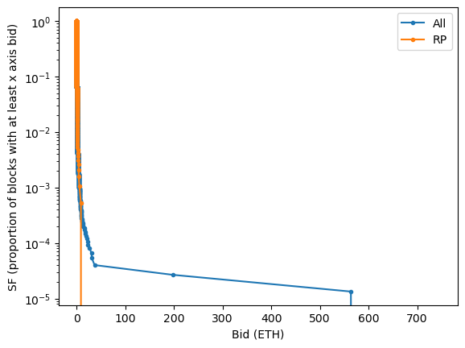

# RocketTheft
Tools for analysing and analysis of the performance of Rocket Pool validators in collecting priority
fees and MEV, and detecting MEV theft. Built for the Rocket Pool GMC's
[Bounty BA032304](https://dao.rocketpool.net/t/july-2023-gmc-call-for-bounty-applications-deadline-is-july-15th/1936/6).

## Analysis
We'll start high level and then go deeper.

This first draft is looking at ~19 weeks of data.

### Global vs RP sanity check
|    |  |
|:--------------------------------------:|:-------------------------------------------:|

The plot above shows a survival function for bids on all blocks and just RP blocks. This is mostly a
sanity check looking at if RP is being consistently lucky or unlucky, and we see no evidence that we
get better or worse bids. The curves move alongside each other well until data becomes too sparse to
be relied on, which is what we'd expect -- no evidence for different "luck" between RP and non-RP.

### Is there systematic theft?
|       |       |
|---------------------------------------------------|----------------------------------------------------------|
|  |  |
|   |   |

> **Reading these survival function plots**  
> For a point on the line, we can read it as "what is the probability (see y-axis) that we get a
> Bid of at least _this much_ (see x-axis)"? The theft hypothesis is that high value blocks would be
> over-represented (higher probability) for the lines other than "RP - MEV boost" (because thieves
> would opportunistically target valuable blocks).

The plots above are likely the most important item in this analysis. They show whether we routinely
see high bids on slots where either the recipient is wrong, vanilla blocks are used, or both. If we
see these issues, especially for lottery blocks, that would be significant evidence of theft.

Evidence for this would look like an orange line being to the upper right of the blue line. Even
more telling would be if this excursion only happened for blocks with high bids. We do not see any
such evidence.

- First row: incorrect fee recipients using MEV boost are super rare; they roughly follow the
  reference and have no real lotto blocks to date
- Second row: if anything, it looks like RP blocks occur in slots with lower max bids. One theory to
  explain this would be that folks likely to use vanilla blocks don't use many relays, which means
  they get smaller max-bids on average.
- Third row: very slightly smaller max-bids, but less so than the second row.

It's important to recognize a couple of limitations. First, the sample size for large blocks is very
small (especially not using MEV boost). Second, if an NO hasn't registered with any relays, they
won't get max bids and won't show up on this plot (see next section for an attempt to handle that).


### Is there systematic theft? Take 2
This is just like the above section, with a twist -- if there's no max_bid for a particular slot,
we take the mean max_bid of the 3 slots before/after as a proxy. This tries to solves the second
limitation mentioned above.

|       |       |
|---------------------------------------------------------|----------------------------------------------------------------|
|  |  |
|   |   |

There's no significant difference.

### Current losses

Running `analysis.py` provides some text in addition to making the plots:

```
=== MEV-Boost Recipient losses  (see results/recipient_losses.csv) ===
1: 10 of 23585 MEV-boost slots used wrong fee recipient
3a: 0.680 total ETH lost due to wrong fee recipient
3b: 0.036 ETH lost per week
3c: APY was 4.448% when it should have been 4.448%
 aka, a 0.00% performance hit

=== Vanilla Recipient losses (see results/vanilla_losses.csv) ===
 342 of 2160 vanilla slots used wrong fee recipient (see results/recipient_losses_vanilla.csv)
~18.581 total ETH lost due to wrong fee recipient
~0.981 ETH lost per week
 APY was ~4.448% when it should have been 4.452%
 aka, a 0.10% performance hit
NB: We take a stab at vanilla losses using 90% of max_bid or sum of priority_fees, but it's possible for vanilla blocks without max_bid to hide offchain fees

=== Non-recipient vanilla losses (see results/vanilla_losses.csv) ===
There were 1818 vanilla RP blocks w/correct recipient
  1483 had bids; we can get ~loss
  335 had no bid; we'll use nearby bids as a guess
4a: ~78.427 ETH lost due to not using relays (or theft)
  Top 5 losses: 17.12, 2.20, 0.76, 0.69, 0.69
4b: ~4.139 ETH lost per week
4c: APY was 4.448% when it could have been ~4.466%
 aka, a 0.41% performance hit

Sanity checking 2 ways of estimating the unknown loss: 29.492 vs 10.927
 if first method is much higher, that means we're seeing vanilla block more often than expected during periods that tend to have high max bids, which is a yellow flag
```

Some takeaways:
- There are much too many vanilla blocks with wrong recipient - around 16% of vanilla blocks!
  - These haven't been a huge loss (0.1% performance), but this loss can appropriately be penalized
- Vanilla blocks in general have been a significant loss (0.41% performance)
  - Note that over 205% of that is a single block

### Vanilla blocks: RP vs nonRP sanity check
|  |  |
|:-------------------------------------------:|:--------------------------------------------------:|

The plot above shows a survival function for bids on RP vanilla blocks vs non-RP vanilla blocks.
Ideally we'd expect the same curves to be followed. They mostly are, and we can guess that the
slightly lower RP values are due to vanilla RP users having fewer relays registered which leads to
lower max bids.

### For reference: goals per the bounty

```
Detail level
1) For each MEV-boost block, check if an acceptable fee recipient was used
2) For each vanilla block, calculate how much was lost by not using MEV-boost

High level
3) Losses due to wrong fee recipient
  3a) Total ETH
  3b) ETH per period
  3c) Effect on APR
4) Losses due to not using MEV-boost
  4a) Total ETH
  4b) ETH per period
  4c) Effect on APR
5) Distribution of MEV-boost bids for
  5a) All block
  5b) All RP blocks
  5c) :star: All RP blocks that use MEV-boost w/correct fee recipient
  5d) :star: All RP blocks that use MEV-boost w/wrong fee recipient
  5e) :star: All vanilla RP blocks
```


## Tools
### Dependencies
- [nodejs & npm](https://nodejs.org/en)
- [jq](https://jqlang.github.io/jq/)
- [g[un]zip](https://www.gnu.org/software/gzip/)
- Access to an Ethereum archive node, providing JSON-RPC for both execution & consensus (beacon) APIs.
- [Flashbots Boost Relay Data](https://flashbots-boost-relay-public.s3.us-east-2.amazonaws.com/index.html)

### Installation
- `npm install` to install the Node.js dependencies.
- Download the Flashbots Boost relay data `.json.gz` files (for the desired slots to analyse) into the `data` directory.

### Usage
- Run `./submissions-to-bids.sh data/builder-submissions_slot-<fromSlot>-to-<toSlot>.json.gz` for each of the relay data files.
- See `node run --help` for more options.
- `node run -s <fromSlot> -t <toSlot>` to create a csv file `data/mevtheft_slot-<fromSlot>-to-<toSlot>.csv` with analysis data.
