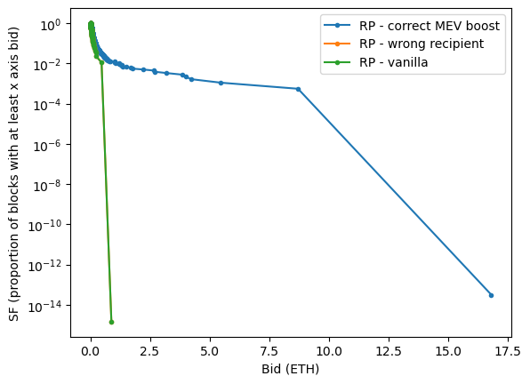

# RocketTheft
Tools for analysing and analysis of the performance of Rocket Pool validators in collecting priority
fees and MEV, and detecting MEV theft. Built for the Rocket Pool GMC's
[Bounty BA032304](https://dao.rocketpool.net/t/july-2023-gmc-call-for-bounty-applications-deadline-is-july-15th/1936/6).

## Analysis
We'll start high level and then go deeper.

This first draft is looking at ~1.7 weeks of data.

### Global vs RP sanity check
|    |  |
|:--------------------------------------:|:-------------------------------------------:|


The plot above shows a survival function for bids on all blocks and just RP blocks. This is mostly a
sanity check looking at if RP is being consistently lucky or unlucky, and we see no evidence that we
get better or worse bids. The curves move alongside each other well until data becomes too sparse to
be relied on at all.

### Is there systematic theft?
|   |  |
|:-----------------------------------------:|:-----------------------------------------------:|

The plot above is likely the most important item in this analysis. It shows whether we routinely see
high bids on blocks where either the recipient is wrong or vanilla blocks are used. If we see either
of these issues, especially for lottery blocks, that would be significant evidence of theft.

We do not see any such evidence. This dataset doesn't have any wrong recipient data. Slots where
vanilla is used seem to have slightly _lower_ bids, if anything.

> **Reading these survival function plots**  
> For a point on the line, we can read it as "what is the probability (see y-axis) that we get a
> Bid of at least _this much_ (see x-axis)"? The theft hypothesis is that high value blocks would be
> over-represented (higher probability) for the lines other than "RP - correct MEV boost" (because
> thieves would opportunistically target valuable blocks).

Note that the current method gets:
- Max bid from only Flashbots relay
  - This is used to calculate losses from vanilla blocks
- MEV reward from any builder/relay that uses the last transaction in a block to send it
  - This is used to calculate losses from incorrect fee recipients 
  - This method was validated on a few thousand slots for the cases that were serviced by Flashbots
  relay

### Current losses

Running `analysis.py` provides some text in addition to making the plots:

```
{'start_eth': 224455.9243660949, 'start_reth': 211241.85867428905, 'end_eth': 539322.5148554122, 'end_reth': 499018.56894404785, 'years': 0.44680165792075444}
Analyzing 23.3 weeks of data (1174999 slots)
Filled in proxy bloxroute max_bids for 149 slots

=== MEV-Boost Recipient losses ===
1: 0 of 345 MEV-boost slots used wrong fee recipient (see results/recipient_losses.csv)
3a: 0.000 total ETH lost due to wrong fee recipient
3b: 0.000 ETH lost per week
3c: APY was 4.08% when it should have been 4.08%

=== Vanilla Recipient losses ===
 1 of 33 vanilla slots used wrong fee recipient (see results/recipient_losses_vanilla.csv)
~0.011 total ETH lost due to wrong fee recipient
~0.000 ETH lost per week
 APY was ~4.08% when it should have been 4.08%
NB: We take a stab at vanilla losses using 90% of max_bid or sum of priority_fees, but it's possible for vanilla blocks without max_bid to hide offchain fees

=== Vanilla losses ===
There were 33 vanilla RP blocks
  24 had bids; we can get ~loss (see results/vanilla_losses.csv)
  9 of them had no bid; we'll use the mean of the above as a guess
4a: ~0.607 known ETH lost due to not using relays
4b: ~0.026 ETH lost per week
4c: APY was 4.08% when it could have been ~4.08%
 aka, a 0.01% performance hit

Sanity checking 2 ways of estimating the unknown loss: 0.187 vs 0.361
 if second method is much higher, that means we're seeing vanilla block more often than expected during periods that tend to have high max bids, which is a yellow flag

=== RP issue counts by node address ===
🚩Wrong recipient used with MEV-boost: Counter()
🚩Wrong recipient used with vanilla: Counter({'0x4680B01D48f107928Dc75C3Ae5C8296D8cB0b5f7': 1})
⚠ No max bid: Counter({'0x6BBbA538C14D36eE92dd3941Afe52736c5cFb842': 5, '0x4680B01D48f107928Dc75C3Ae5C8296D8cB0b5f7': 1, '0xB81E87018Ec50d17116310c87b36622807581fa6': 1, '0x5280B7aD2aFF8872C4110A0EA2E919c616F55D19': 1, '0x2F8ef05D6AAAe98Af0D10Ef4Cec24750fb819Ce2': 1})
⚠ Vanilla blocks: Counter({'0xb8ed9ea221bf33d37360A76DDD52bA7b1E66AA5C': 7, '0x6BBbA538C14D36eE92dd3941Afe52736c5cFb842': 5, '0xDdCcE65862fb2bD21271C71cf0b1b54F64128C33': 2, '0xED8Da4DAF5B1b112fD27123ca414496cf033A3bb': 2, '0x4680B01D48f107928Dc75C3Ae5C8296D8cB0b5f7': 1, '0x71dd99490C5e36A22B2a73f31225fA5Fa40223D1': 1, '0xD75b16EB967546591199AC6f4bA0D51C123E6cf6': 1, '0xB81E87018Ec50d17116310c87b36622807581fa6': 1, '0xca317A4ecCbe0Dd5832dE2A7407e3c03F88b2CdD': 1, '0x17Fa597cEc16Ab63A7ca00Fb351eb4B29Ffa6f46': 1, '0x63e7549Ea16F52Bcb0415B308F17f3FeE6415138': 1, '0x5280B7aD2aFF8872C4110A0EA2E919c616F55D19': 1, '0x4f9861628107300FbB4981eA22B85Ec0c348fd5A': 1, '0x949953B4aB9748992f3B9841E2f510d502Ec2C8E': 1, '0x2b6fCa9AD7EBd5408dB009f0DF087Ffd934cF98e': 1, '0xaE522d18D9eDf0b5c6997Dfc79b3eAD1363059F2': 1, '0xc5D291607600044348E5014404cc18394BD1D57d': 1, '0x7f733E416d96a6CC3D0907dd35b7c3C7fF23ddcf': 1, '0x2F8ef05D6AAAe98Af0D10Ef4Cec24750fb819Ce2': 1, '0x47730Ef452712168a1d05f4E5c4c123dcc5f8550': 1, '0x2C1ec76e2fB8B8f070b4687C122e8dee0EC79A63': 1})

Process finished with exit code 0

```

The main take-away I found here is that vanilla blocks do represent a real performance hit.

### Vanilla blocks: RP vs nonRP sanity check
|  |  |
|:-------------------------------------------:|:--------------------------------------------------:|


The plot above shows a survival function for bids on RP vanilla blocks vs non-RP vanilla blocks.
Ideally we'd expect the same curves to be followed (and they are). If they were different, we'd have
to try to interpret it from between various explanations.

### For reference: goals per the bounty

```
Detail level
1) For each MEV-boost block, check if an acceptable fee recipient was used
2) For each vanilla block, calculate how much was lost by not using MEV-boost

High level
3) Losses due to wrong fee recipient
  3a) Total ETH
  3b) ETH per period
  3c) Effect on APR
4) Losses due to not using MEV-boost
  4a) Total ETH
  4b) ETH per period
  4c) Effect on APR
5) Distribution of MEV-boost bids for
  5a) All block
  5b) All RP blocks
  5c) :star: All RP blocks that use MEV-boost w/correct fee recipient
  5d) :star: All RP blocks that use MEV-boost w/wrong fee recipient
  5e) :star: All vanilla RP blocks
```


## Tools
### Dependencies
- [nodejs & npm](https://nodejs.org/en)
- [jq](https://jqlang.github.io/jq/)
- [g[un]zip](https://www.gnu.org/software/gzip/)
- Access to an Ethereum archive node, providing JSON-RPC for both execution & consensus (beacon) APIs.
- [Flashbots Boost Relay Data](https://flashbots-boost-relay-public.s3.us-east-2.amazonaws.com/index.html)

### Installation
- `npm install` to install the Node.js dependencies.
- Download the Flashbots Boost relay data `.json.gz` files (for the desired slots to analyse) into the `data` directory.

### Usage
- Run `./submissions-to-bids.sh data/builder-submissions_slot-<fromSlot>-to-<toSlot>.json.gz` for each of the relay data files.
- See `node run --help` for more options.
- `node run -s <fromSlot> -t <toSlot>` to create a csv file `data/mevtheft_slot-<fromSlot>-to-<toSlot>.csv` with analysis data.
